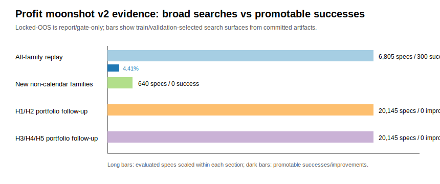

# Profit moonshot alpha-discovery v2 read-only research sprint — Task 1

[OBJECTIVE] Identify honest next alpha-discovery lanes that could beat the current champion without metric manipulation.

Constraints honored: train/validation-only selection, locked-OOS report/gate-only, current champion preserved unless all gates pass, `<8 GiB` RSS, no new dependencies, no heavy recomputation, and no source-code strategy edits. Evidence was read from committed artifacts with shell/jq only; no Python analysis code was executed via Bash.

[DATA] Current champion from `var/reports/profit_moonshot_20260501/current_tail_20260508/all_family_expansion/passing_candidate_latest.json`: train `3.5993%`, validation `2.6755%`, locked-OOS `1.2181%`, OOS MDD `0.1662%`, OOS Sharpe `6.7264`.

[DATA] Search evidence reviewed:
- All-family expansion: `6,805` replay specs, `58,224` portfolio specs, `128` Optuna trials.
- Follow-up H1/H2 allocator: `20,145` portfolio specs.
- Follow-up H3/H4/H5 calendar-conditioned replay/portfolio: `80` replay specs and `20,145` portfolio specs.
- Support inventory: five current-tail symbols (`BNB`, `BTC`, `ETH`, `SOL`, `TRX`) with funding/mark/index/OI coverage; taker-flow exists only for `BTC/ETH/SOL`; liquidation rows are zero for all five symbols.

[FINDING] The current promotable edge is still calendar/TRX-dominated, not standalone non-calendar alpha.
[STAT:n] All-family replay `n=6,805` specs; replay successes `300`; success-family count: `calendar_rotation=300` and non-calendar `0`.
[STAT:effect_size] Overall replay pass rate `4.41%`; non-calendar pass rate `0/2,413 = 0.00%`.
[STAT:ci] Rule-of-three 95% upper bound for the non-calendar pass rate is `<0.13%` (`3/2,413`).

[FINDING] The newly added standalone non-calendar families have insufficient evidence for promotion.
[STAT:n] New-family assessment `n=640` specs across adaptive trend fade, compression breakout fade, cross-sectional Sharpe reversal, funding carry momentum, and residual momentum.
[STAT:effect_size] New-family promoted successes `0/640 = 0.00%`.
[STAT:ci] Rule-of-three 95% upper bound for new-family success is `<0.47%` (`3/640`).

[FINDING] High-return additive diagnostics are alpha clues, not deployable candidates, because they trade OOS return for excessive drawdown.
[STAT:n] H1/H2 portfolio follow-up evaluated `20,145` specs and produced `0` improved/promoted candidates.
[STAT:effect_size] H1/H2 selected-by-validation OOS return was `2.1374%` (`+0.9193%p` vs champion), but OOS MDD was `0.6571%` (`+0.4909%p` vs champion); failed `oos_return_risk_beats_current_champion` and `oos_mdd_beats_shadow`.
[STAT:ci] Rule-of-three 95% upper bound for H1/H2 improved-candidate rate is `<0.015%` (`3/20,145`).

[FINDING] H3/H4/H5 follow-ups confirmed that calendar-conditioned vetoes can lift return but still fail the risk gate.
[STAT:n] H3/H4/H5 replay `n=80` specs: `0` survivors and `0` success candidates; portfolio follow-up `n=20,145` specs: `0` improved candidates.
[STAT:effect_size] H3/H4/H5 selected-by-validation portfolio OOS return was `2.2229%` (`+1.0048%p` vs champion), but OOS MDD was `0.7026%` (`+0.5363%p` vs champion) and OOS Sharpe `3.2651` (`-3.4613` vs champion).
[STAT:ci] Rule-of-three 95% upper bound for H3/H4/H5 improved portfolio rate is `<0.015%` (`3/20,145`).

[FINDING] A direct liquidation/forced-flow event alpha cannot honestly be selected from the present current-tail artifact set until coverage is fixed.
[STAT:n] Support inventory covers `5` symbols; taker-flow coverage `3/5` symbols (`BTC/ETH/SOL`), liquidation coverage `0/5` symbols, and core champion symbol `TRX` has `0` taker-flow rows plus `0` liquidation rows.
[STAT:effect_size] Liquidation feature coverage gap is `100%` across the current five-symbol universe; TRX forced-flow direct-entry coverage gap is `100%`.
[STAT:ci] With `0/5` liquidation-covered symbols, the small-sample rule-of-three upper bound is not decision-useful (`<60%`), so the correct action is data preflight/backfill before claiming alpha evidence.

## Ranked next feasible lanes

1. **Forced-flow/liquidation preflight lane (data first, not promotion first).** Backfill or verify liquidation rows and TRX/BNB taker-flow coverage, then run train/validation-only screens. Until then, forced-flow can be used only as a BTC/ETH/SOL market-shock veto/regime feature for calendar sleeves, not as a standalone TRX event alpha.
2. **Risk-budgeted diagnostic compression lane.** The strongest signal is high return with too much MDD. Search should target ex-ante train/validation drawdown budgets, per-cluster exposure decay, and volatility/flow state cuts before any OOS check.
3. **Cadence/execution-cost lane.** Existing `run_profit_moonshot_cadence_sweep.py` supports validation-first screening and full train/OOS only for survivors. This is independent from H1-H6 parameter grids and may reduce drawdown by changing execution cadence rather than entry alpha.
4. **Causal/dynamic allocator lane over saved sleeves.** Existing causal allocator scripts can search validation-only allocation policies over saved return streams under the portfolio memory guard; this is a safer next step than inventing new all-hours standalone entries.

## Stop / gate conditions for next work

- Do not promote any candidate unless train and validation are positive and stronger on return/risk, locked-OOS passes all gates, OOS return exceeds `1.2181%`, MDD remains below the shadow/current risk gate, and peak RSS remains `<8 GiB`.
- Treat all OOS-ranked or MDD-failed rows as `diagnostic_not_promoted`.
- Run one heavy backtest at a time if a future worker moves from read-only research to execution.

[LIMITATION] This was a read-only sprint over existing artifacts, not a fresh backtest. Reported confidence intervals use rule-of-three binomial upper bounds for zero-success surfaces, not distributional return CIs. OOS metrics are cited only as gate/report evidence, not as selection criteria.

[LIMITATION] Current forced-flow evidence is coverage-limited: BTC/ETH/SOL have taker-flow, but TRX/BNB lack taker-flow and all five current-tail symbols lack liquidation rows. This blocks honest liquidation alpha selection until data coverage changes.

Sources: `docs/profit_moonshot_next_hypotheses_20260508.md`, `docs/session_handoff_20260509_profit_moonshot_h6_h1_h2_calendar_allocator.md`, `docs/session_handoff_20260509_profit_moonshot_h3_h4_h5_calendar_conditioned.md`, and artifacts under `var/reports/profit_moonshot_20260501/current_tail_20260508/`.
