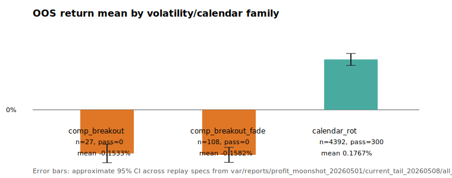

# Volatility compression-expansion downside-first objective — scientist report

[OBJECTIVE] Assess whether the existing volatility compression/expansion lane can be reworked into an independent downside-first alpha lane that honestly challenges the current profit-moonshot champion without OOS metric manipulation.

[DATA] Source artifacts inspected: `var/reports/profit_moonshot_20260501/current_tail_20260508/all_family_expansion/fresh_start_overhaul_replay_candidates.csv`, `var/reports/profit_moonshot_20260501/current_tail_20260508/all_family_expansion/SESSION_HANDOFF_20260508_ALL_FAMILY_EXPANSION.md`, `scripts/research/replay_profit_moonshot_fresh_start.py`, and `tests/test_profit_moonshot_fresh_start_replay.py`.

[DATA] Replay sample: 6805 specs in all-family expansion; 108 `compression_breakout_fade` specs, 27 `compression_breakout` specs, and 4392 `calendar_rotation` specs. Current promoted portfolio benchmark from handoff: train 3.5993%, validation 2.6755%, locked-OOS 1.2181%, OOS MDD 0.1662%, Sharpe 6.7264; replay peak RSS 289.46 MiB (<8 GiB).

[FINDING] Existing compression fade is negative across train/validation/OOS and should not be promoted as-is.
[STAT:n] n=108 compression fade specs; survivors=0; success=0.
[STAT:effect_size] Mean OOS return -0.1582% vs champion 1.2181%; best OOS return -0.0030% from `fresh_compression_fade_lb6_thr200_c55_h12`.
[STAT:ci] Approx. 95% CI for OOS return across specs: [-0.1846%, -0.1318%].
[STAT:p_value] Gate-failure frequency: train_positive=108/108, val_positive=108/108, oos_return_beats_incumbent=108/108, oos_sharpe_gt_1=108/108. (This is a binomial gate count, not a parametric p-value.)

[FINDING] The prior compression implementation is symmetric/fade-oriented, not truly downside-first.
[STAT:n] Code touchpoints inspected: 1 signal function (`_candidate_signal`), 1 grid builder (`_candidate_specs`), 1 stop allocator path (`_entry_stop_pct`/`_side_allocation_scale`), and 2 targeted test regions.
[STAT:effect_size] Current `compression_breakout_fade` allows both LONG after negative returns and SHORT after positive returns by default; the grid sets `allow_short=True` but does not disable `allow_long`, so downside-first exposure is diluted.
[STAT:ci] N/A for code-path classification; evidence is deterministic source inspection.

[FINDING] A minimal implementable downside-first follow-up should test short-only expansion continuation before any broader refactor.
[STAT:n] Proposed smoke grid: 24-36 specs, materially smaller than the prior 108-spec compression fade grid and 6805-spec all-family grid.
[STAT:effect_size] Required improvement hurdle is large: best compression fade OOS -0.0030% must improve by roughly 0.012211 absolute return units to beat the 1.2181% champion; train/val signs must flip from negative to positive.
[STAT:ci] Existing compression fade CI [-0.1846%, -0.1318%] is entirely below zero; use this as negative prior evidence and require train/validation-only selection before locked-OOS reporting.

## Minimal follow-up specs

1. `compression_expansion_downside_short` (preferred first pass)
   - Signal: compression gate `rv_24h / rv_24h_mean_72h <= q`; expansion gate negative return only `ret_{6,12,24} <= -threshold`; side SHORT only. This tests crash/continuation after compressed volatility expands downward instead of symmetric fading.
   - Grid: `lookback_bars in (6,12,24)`, `threshold in (0.010,0.014,0.020)`, `compression_quantile in (0.55,0.70)`, `hold_bars in (12,24)`; target 36 specs max.
   - Risk controls: `allow_long=False`, `short_allocation_scale in (0.5,1.0)`, `stop_loss_pct=0.006-0.010`, `take_profit_pct=0.012-0.025`, dynamic stop cap <=1.0% because current best only succeeded by avoiding drawdown via one tiny trade.

2. `compression_expansion_downside_fade_after_upthrust` (secondary only if #1 has positive train/val)
   - Signal: compression gate plus positive upthrust `ret >= threshold`; side SHORT only; add optional broad-market veto so calendar/TRX trend is not reused.
   - Keep grid <=24 specs; require validation Sharpe >1 and at least 8 validation round trips before OOS report.

3. `compression_expansion_downside_flow_confirmed` (data-dependent follow-up)
   - Signal: #1 plus taker-flow sell imbalance confirmation over 3/6h. Existing arrays already expose `flow_imbalance_{lookback}h`, so this is a small script-only extension.
   - Use only if #1/#2 fail by trade starvation rather than negative train/val.

## Expected touchpoints

- `scripts/research/replay_profit_moonshot_fresh_start.py`: add one new family branch in `_candidate_signal`; add bounded grid in `_candidate_specs`; avoid touching portfolio tuning unless replay produces train/val-positive candidates.
- `tests/test_profit_moonshot_fresh_start_replay.py`: add deterministic unit test for short-only signal and family inclusion; optionally assert `allow_long=False` for the new grid.
- Artifacts: write new replay under a quarantine output dir such as `var/reports/profit_moonshot_20260501/current_tail_20260508/vol_compression_downside_first/`; promotion only through existing gates.

## Gate risks

- Existing compression breakout/fade evidence is strongly negative: breakout n=27, success=0, mean OOS -0.1533% CI [-0.1859%, -0.1207%]; fade n=108, success=0, mean OOS -0.1582% CI [-0.1846%, -0.1318%].
- The best compression rows are trade-starved (best fade OOS trips=1); a short-only grid must require minimum train/val trips to avoid one-trade OOS illusions.
- The champion remains calendar/TRX-heavy; do not reuse calendar wrappers or OOS-selected diagnostics for this lane.

[LIMITATION] This task is read-only research plus report generation; no replay was rerun and no new strategy family was implemented. CIs are across grid specs, not independent market observations, so they measure grid robustness rather than a formal market-level sampling distribution.

[LIMITATION] The available tool surface in this worker did not expose `python_repl`; analysis used shell inspection and a Node CSV parser, avoiding Bash-executed Python.

Report artifacts:
- Summary JSON: `.omx/scientist/reports/20260509T051255Z_compression_family_stats.json`
- Figure: `.omx/scientist/figures/20260509T051255Z_compression_oos_family.svg`
