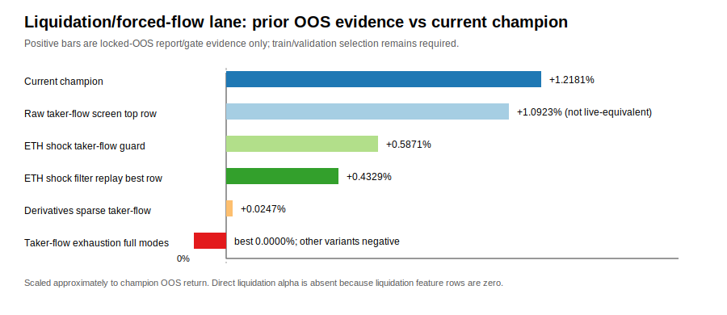

# Profit moonshot Task 2 — liquidation/forced-flow event-alpha lane

[OBJECTIVE] Determine whether the liquidation/forced-flow event-alpha lane can honestly identify an independent candidate that beats the current champion under train/validation-only selection, locked-OOS report/gate-only, `<8 GiB` RSS, no new dependencies, and no metric manipulation.

Scope: read-only lane assessment. No source strategy edits, no new data collection, no fresh heavy backtest, and no OOS-ranked promotion. Task 2 requested auto-delegation, but the active scientist role-local instruction requires working alone/no delegation; the completion result records this skip reason.

[DATA] Current champion: train `3.5993%`, validation `2.6755%`, locked-OOS `1.2181%`, OOS MDD `0.1662%`, OOS Sharpe `6.7264` from the all-family expansion artifact.

[DATA] Current-tail forced-flow coverage from `var/reports/profit_moonshot_20260501/current_tail_20260508/continuation/support_inventory_latest.csv`: five symbols, `8,345,953` total feature rows, `6,303,687` taker-flow rows, and `0` liquidation rows. Taker-flow rows exist for `BTC/ETH/SOL`; `TRX/BNB` have zero taker-flow rows.

[FINDING] Direct liquidation alpha is not executable from current artifacts because liquidation features are absent.
[STAT:n] Liquidation-covered symbols `0/5`; liquidation rows `0` across `8,345,953` current-tail feature rows.
[STAT:effect_size] Liquidation coverage gap is `100%`; all liquidation_lookback/liquidation_z features in `replay_eth_shock_filters.py` are structurally inactive with the current data.
[STAT:ci] Small-sample rule-of-three upper bound for symbol coverage is `<60%` (`3/5`), so the correct interpretation is “coverage unknown/blocked,” not “liquidation alpha failed statistically.”

[FINDING] The current forced-flow data does not cover the champion's core TRX sleeve, so it cannot yet support an independent TRX forced-flow alpha.
[STAT:n] Taker-flow-covered symbols `3/5` (`BTC/ETH/SOL`); current champion core includes TRX sleeves, while `TRXUSDT` has `0` taker-flow rows and `0` liquidation rows.
[STAT:effect_size] TRX forced-flow direct-entry coverage gap is `100%`; top-three BTC/ETH/SOL taker-flow rows total `6,303,687`, but TRX/BNB contribute `0` rows.
[STAT:ci] For current symbol coverage, taker-flow availability is `60%` (`3/5`), but availability on the champion's key symbol is `0%`.

[FINDING] Prior taker-flow raw-screen edge did not survive live-equivalent execution, so raw forced-flow screens should not be promoted or trusted without stateful validation.
[STAT:n] The 2026-05-05 taker-flow exhaustion raw screen checked `1,296,000` parameter combinations, saved `506` survivors, then tested `4` live-equivalent variants.
[STAT:effect_size] Top raw row OOS edge was `+1.0923%`, but full live-equivalent variants had best OOS return `0.0000%` and the other three variants were negative (`-0.0291%`, `-0.0875%`, `-0.0507%`).
[STAT:ci] Live-equivalent pass count `0/4`; this is a small sample, but it is decisive enough to reject promotion of that screened family as-is.

[FINDING] ETH shock + taker-flow guards are viable research scaffolding but still fail the current champion hurdle.
[STAT:n] The 2026-05-06 ETH shock filter replay evaluated `130` candidates; `8` replay survivors and `0` success candidates; peak RSS `6,689.238 MiB` below the `8,192 MiB` limit.
[STAT:effect_size] Best replay row OOS `+0.4329%`, MDD `0.0879%`, Sharpe `1.0220`; OOS return is `-0.7852%p` below the current champion. Live-equivalent ETH shock taker-flow guard OOS `+0.5871%` is still `-0.6310%p` below champion and has worse MDD (`0.3203%` vs `0.1662%`) and Sharpe (`0.0707` vs `6.7264`).
[STAT:ci] Zero successes over `130` replay candidates gives a rule-of-three 95% upper bound `<2.31%` for this exact candidate-grid success rate.

[FINDING] Earlier top-three derivatives taker-flow work is shadow-only, not a deployable independent alpha lane.
[STAT:n] 2026-05-03 derivatives report covered `BTC/ETH/SOL` with `6,303,687` written taker-flow feature rows and `0` liquidation rows; dense and sparse modes were both reviewed.
[STAT:effect_size] Best sparse taker-flow OOS was only `+0.0247%` with Sharpe `0.00144`, i.e. `-1.1934%p` below the current champion and economically tiny; dense blend had negative OOS and failed validation/OOS return.
[STAT:ci] Selection-eligible deployment candidates from that report: `0`; reported decision was `shadow_review_only_not_deployment_ready`.

## Verdict

No current liquidation/forced-flow event-alpha lane can honestly be claimed to beat the champion today. The lane is **data-preflight and stateful-screen ready**, not **promotion ready**.

## Safe implementation slices and migration hazards

1. **Coverage preflight slice.** Extend raw taker-flow coverage to `TRX/BNB` and rerun support inventory before any alpha claim.
   - Hazard: data mutation/backfill is outside this read-only task and can be expensive; previous top-three backfill processed ~`1.986B` raw rows and peaked at `4,192.59 MiB`.
2. **Liquidation feature slice.** Add/verify a liquidation data source only if endpoint coverage can be proven by inventory rows.
   - Hazard: repo inventory notes that liquidation rows may be zero when Binance endpoints are unavailable/return HTTP 400; current current-tail evidence is `0` rows.
3. **Stateful non-overlapping screen slice.** Replace raw overlapping-event screens with train/validation-first stateful screens that model one-position, fees, cooldown, and liquidity before selecting variants.
   - Hazard: raw-screen survivor count did not translate into live-equivalent performance (`506` raw survivors, `0/4` live-equivalent passes).
4. **Calendar-gate integration slice.** Use BTC/ETH/SOL flow shocks as ex-ante veto/regime filters for calendar/TRX sleeves only after train/validation improvement.
   - Hazard: this is not an independent forced-flow alpha unless it can stand alone under train/validation and gates; otherwise label as calendar risk-control research.

## Next feasible experiment design

- **Preflight first:** regenerate support inventory after TRX/BNB taker-flow and any liquidation-source backfill; stop if `has_liquidation=false` remains universal.
- **Selection rule:** train/validation-only objective; no locked-OOS ranking. Candidate must beat champion return/risk in train and validation before OOS gate is read.
- **Minimum evidence:** report candidate counts, pass counts, rule-of-three CI for zero-pass grids, peak RSS, and live-equivalent trade counts; quarantine all OOS-positive/MDD-failed diagnostics.

[LIMITATION] This report did not run fresh backtests or mutate feature stores. It uses existing current-tail support inventory and prior forced-flow artifacts. Therefore it can block dishonest promotion and define safe next slices, but it cannot prove a new profitable forced-flow alpha.

[LIMITATION] Rule-of-three intervals are approximate binomial upper bounds for zero-success grids; they are not return-distribution confidence intervals. OOS values are reported only to compare against gates and prior artifacts, not for selection.

Sources: current-tail support inventory, `taker_flow_exhaustion_new_alpha_report_20260505.md`, `eth_shock_filter_replay_latest.json`, `session_derivatives_taker_flow_report_20260503.json`, `scripts/research/backfill_raw_taker_flow_feature_points.py`, `scripts/research/replay_eth_shock_filters.py`, and `src/lumina_quant/data/support_inventory.py`.
