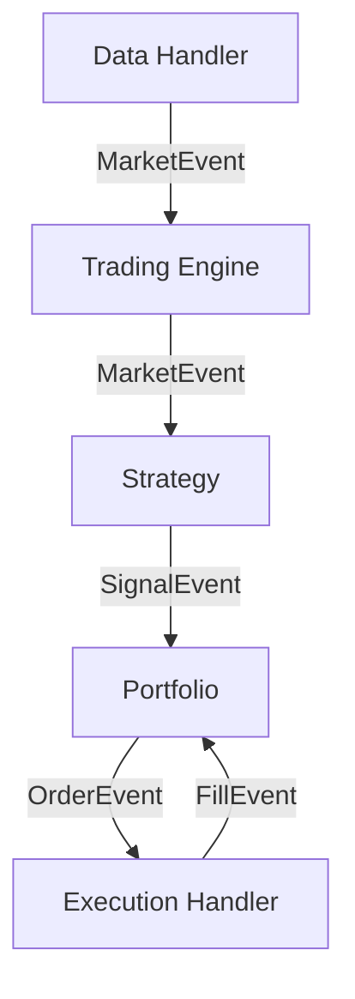

[Korean Version (한국어 가이드)](README_KR.md)

# LuminaQuant Documentation

**LuminaQuant** is an advanced, event-driven quantitative trading system designed for professional-grade backtesting and live trading. It features a modular architecture that supports multiple exchanges, robust state management, and sophisticated strategy optimization.

---

## 📚 Documentation Index

| Section | Description |
| :--- | :--- |
| **[Installation & Setup](#installation)** | Getting started with LuminaQuant. |
| **[Deployment Guide](docs/DEPLOYMENT.md)** | **New**: Docker & VPS Setup for 24/7 Trading. |
| **[Exchange Guide](docs/EXCHANGES.md)** | Detailed setup for **Binance** (CCXT) and **MetaTrader 5**. |
| **[Trading Manual](docs/TRADING_MANUAL.md)** | **How-To**: Buy/Sell, Leverage, TP/SL, Trailing Stops. |
| **[Performance Metrics](docs/METRICS.md)** | Explanation of Sharpe, Sortino, Alpha, Beta, etc. |
| **[Developer API](docs/API.md)** | How to write Strategies and extend the system. |
| **[Configuration](#configuration)** | Quick reference for `config.yaml`. |

## 🏗 Architecture

LuminaQuant follows a modular **Event-Driven Architecture**:



- **DataHandler**: Manages historical (CSV) or live (WebSocket) data feeds.
- **Strategy**: Generates `SignalEvent` based on market data (e.g., RSI < 30).
- **Portfolio**: Manages state, positions, and risk. Converts Signals to `OrderEvent`.
- **ExecutionHandler**: Simulates fills (Backtest) or executes usage API (Live).

---

## ⚙️ Setup & Configuration

### Prerequisites
- Python 3.11 to 3.13
- [Polars](https://pola.rs/) (for high-performance data)
- [Talib](https://github.com/TA-Lib/ta-lib-python) (for technical indicators)

### Environment Variables
For security, **never commit API keys**. Create a `.env` file in the root directory:

```ini
# .env file
BINANCE_API_KEY=your_api_key
BINANCE_SECRET_KEY=your_secret_key
LOG_LEVEL=INFO
```

*See `.env.example` for a template.*

---

## 🚀 Quick Start

### 1. Installation

```bash
# Clone the repository
git clone https://github.com/HokyoungJung/LuminaQuant.git
cd lumina-quant

# Install dependencies
uv sync  # or pip install ".[live,optimize,dashboard]"

# Verify install and tests
python scripts/verify_install.py

# (Optional) For MT5 Support
pip install MetaTrader5
```

### 2. Configuration

LuminaQuant uses `config.yaml` for all settings.

**Generic Setup:**
```yaml
trading:
  symbols: ["BTC/USDT", "ETH/USDT"]
  timeframe: "1h"
  initial_capital: 10000.0
```

**Choose Your Exchange:**

*   **Binance (Crypto)**: Set `driver: "ccxt"`
*   **MetaTrader 5 (Forex/Stocks)**: Set `driver: "mt5"`

*👉 See [Exchange Guide](docs/EXCHANGES.md) for detailed credentials setup.*

### 3. Running the System

**Backtest a Strategy:**
```bash
python run_backtest.py
```

**Walk-Forward Optimization (multi-fold):**
```bash
python optimize.py
```

**Architecture/Lint Gate:**
```bash
python scripts/check_architecture.py
ruff format . --check
ruff check .
```

**Visualize Results:**
```bash
streamlit run dashboard.py
```

**Start Live Trading:**
```bash
python run_live.py
# Real mode requires explicit safety flag:
# LUMINA_ENABLE_LIVE_REAL=true python run_live.py --enable-live-real
```

**Generate 14-day Soak Report (Promotion Gate):**
```bash
python scripts/generate_soak_report.py --db logs/lumina_quant.db --days 14
```

**Backtest Benchmark Baseline/Regression:**
```bash
python scripts/benchmark_backtest.py --output reports/benchmarks/baseline_snapshot.json
```

---

## 🌟 Key Features

- **Event-Driven Core**: Simulates realistic execution by processing events (`Market`, `Signal`, `Order`, `Fill`) sequentially.
- **Multi-Asset & Multi-Exchange**:
    - Trade **Crypto** on Binance, Bybit, Upbit (via CCXT).
    - Trade **Forex, CFTs, Stocks** on MetaTrader 5.
- **Advanced Backtesting**: Includes slippage, commission models, and trailing stop logic.
- **Optimization**: Built-in Bayesian Optimization using **Optuna** to find the best strategy parameters.
- **Live Resilience**:
    - **State Recovery**: Syncs positions on restart.
    - **Circuit Breakers**: Halts trading if daily loss exceeds limits.

---

## 📊 Dashboard Preview

The included Streamlit dashboard provides professional-grade analytics:

- **Equity Curve & Drawdowns**: Visualize your portfolio growth and risk.
- **Trade Analysis**: See exactly where buys and sells occurred on the chart.
- **Comprehensive Metrics**: Sharpe Ratio, Sortino, Calmar, Alpha, Beta, etc.

*👉 See [Performance Metrics](docs/METRICS.md) for a full definition of all stats.*
