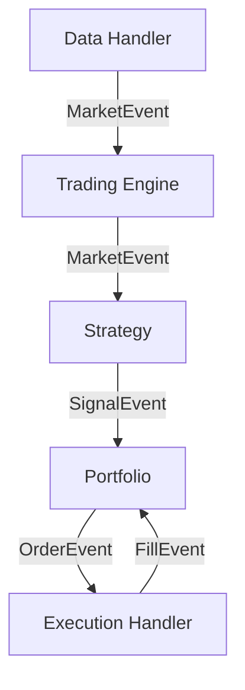

[Korean Version (한국어 가이드)](README_KR.md)

# LuminaQuant Documentation

**LuminaQuant** is an advanced, event-driven quantitative trading system designed for professional-grade backtesting and live trading. It features a modular architecture that supports multiple exchanges, robust state management, and sophisticated strategy optimization.

---

## 📚 Documentation Index

| Section | Description |
| :--- | :--- |
| **[Installation & Setup](#installation)** | Getting started with LuminaQuant. |
| **[Deployment Guide](docs/DEPLOYMENT.md)** | Deployment notes and operational checklist. |
| **[Migration Guide](docs/MIGRATION_GUIDE_POSTGRES_PARQUET.md)** | Local-only migration to Parquet + PostgreSQL. |
| **[GPU Auto Notes](docs/DESIGN_NOTES_GPU_AUTO.md)** | Polars GPU/CPU auto-selection and fallback design. |
| **[Validation Report](docs/VALIDATION_REPORT.md)** | Verification + optimization report for core workflows. |
| **[Futures Strategy Factory](docs/FUTURES_STRATEGY_FACTORY.md)** | Candidate generation, weighted shortlist, and portfolio-set policy. |
| **[Workflow Guide](docs/WORKFLOW.md)** | Private/Public branch operation and publish checklist. |
| **[Dashboard Realtime Report](docs/DASHBOARD_REALTIME_ANALYSIS_REPORT.md)** | Analysis + implementation report for live-refresh dashboard behavior. |
| **[Exchange Guide](docs/EXCHANGES.md)** | Detailed setup for **Binance** (CCXT) and **MetaTrader 5**. |
| **[Trading Manual](docs/TRADING_MANUAL.md)** | **How-To**: Buy/Sell, Leverage, TP/SL, Trailing Stops. |
| **[Performance Metrics](docs/METRICS.md)** | Explanation of Sharpe, Sortino, Alpha, Beta, etc. |
| **[Developer API](docs/API.md)** | How to write Strategies and extend the system. |
| **[Configuration](#configuration)** | Quick reference for `config.yaml`. |

## 🏗 Architecture

LuminaQuant follows a modular **Event-Driven Architecture**:



- **DataHandler**: Manages historical (CSV) or live (WebSocket) data feeds.
- **Strategy**: Generates `SignalEvent` based on market data (e.g., RSI < 30).
- **Portfolio**: Manages state, positions, and risk. Converts Signals to `OrderEvent`.
- **ExecutionHandler**: Simulates fills (Backtest) or executes usage API (Live).

Current local-first stack defaults:
- **1s market store**: Parquet (ZSTD, exchange/symbol/date partitioning)
- **State/audit/job control**: PostgreSQL (local)
- **Backtest/optimization compute**: Polars Lazy with automatic GPU/CPU execution mode

---

## ⚙️ Setup & Configuration

### Prerequisites
- Python 3.11 to 3.13
- [uv](https://docs.astral.sh/uv/) for dependency/runtime management
- [Polars](https://pola.rs/) (for high-performance data)
- [Talib](https://github.com/TA-Lib/ta-lib-python) (for technical indicators)

### Environment Variables
For security, **never commit API keys**. Create a `.env` file in the root directory:

```ini
# .env file
BINANCE_API_KEY=your_api_key
BINANCE_SECRET_KEY=your_secret_key
LQ_POSTGRES_DSN=postgresql://localhost:5432/luminaquant
LQ_GPU_MODE=auto
LQ_GPU_DEVICE=0
LOG_LEVEL=INFO
```

*See `.env.example` for a template.*

---

## 🚀 Quick Start

### 1. Installation

```bash
# Clone the repository
git clone https://github.com/HokyoungJung/LuminaQuant.git
cd lumina-quant

# Ensure compatible Python (project requires < 3.14)
uv python pin 3.13

# Install dependencies (uv-only runtime)
uv sync --all-extras

# Verify install and tests
uv run python scripts/verify_install.py

# (Optional) For MT5 Support
uv sync --extra mt5
```

### 2. Configuration

LuminaQuant uses `config.yaml` for all settings.

**Generic Setup:**
```yaml
trading:
  symbols: ["BTC/USDT", "ETH/USDT"]
  timeframe: "1h"
  initial_capital: 10000.0
```

**Choose Your Exchange:**

*   **Binance (Crypto)**: Set `driver: "ccxt"`
*   **MetaTrader 5 (Forex/Stocks)**: Set `driver: "mt5"`

*👉 See [Exchange Guide](docs/EXCHANGES.md) for detailed credentials setup.*

### Public vs Private Repository Scope

- This public repository intentionally excludes proprietary research IP:
  - `lumina_quant/indicators/`
  - `strategies/`
  - private strategy/indicator test files
- This public repository also excludes DB construction/sync code:
  - `lumina_quant/data_sync.py`
  - `lumina_quant/data_collector.py`
  - `scripts/sync_binance_ohlcv.py`
  - `scripts/collect_market_data.py`
  - `tests/test_data_sync.py`
- Full strategy/indicator implementation and AGENTS guidance are maintained in the private repository.
- Database/runtime artifacts are never published (`data/`, `logs/`, `.omx/`, `.sisyphus/`).

### 3. Running the System

**(Private repo only) Sync Binance OHLCV into local Parquet market storage (and CSV mirror):**
```bash
uv run python scripts/sync_binance_ohlcv.py \
  --symbols BTC/USDT ETH/USDT \
  --timeframe 1m \
  --db-path data/market_parquet \
  --force-full
```

In the public repository, sync/build helpers are intentionally removed. Use prebuilt market parquet files or CSV data.

**Backtest a Strategy:**
```bash
uv run python run_backtest.py

# Force DB-only data source
uv run python run_backtest.py --data-source db --market-db-path data/market_parquet
```

**Walk-Forward Optimization (multi-fold):**
```bash
uv run python optimize.py

# Prefer DB data, fallback to CSV in auto mode
uv run python optimize.py --data-source auto --market-db-path data/market_parquet
```

**Architecture/Lint Gate:**
```bash
uv run python scripts/check_architecture.py
uv run ruff format . --check
uv run ruff check .
```

**Visualize Results:**
```bash
uv run streamlit run dashboard.py
```

Dashboard now includes no-code workflow controls for backtest, optimization, and live launch/stop with:
- asynchronous managed jobs and log tail viewer
- explicit real-mode arming phrase (`ENABLE REAL`)
- graceful stop via control-file signal and emergency force-kill fallback
- optimization results panel from Postgres (`optimization_results`)
- ghost cleanup controls (dry-run/apply) for stale `RUNNING` rows
- strategy-scoped run filtering (`Filter Run IDs By Strategy`) and automatic run reselection on strategy change
- separate `Market Data DSN` so market OHLCV source can differ from runtime state DSN
- explicit CSV fallback warning when equity is rendered from CSV samples instead of Postgres run rows

**Ghost Cleanup CLI (stale RUNNING rows):**
```bash
# Dry-run (recommended first)
uv run python scripts/cleanup_ghost_runs.py --dsn \"$LQ_POSTGRES_DSN\" --stale-sec 300 --startup-grace-sec 90

# Apply cleanup
uv run python scripts/cleanup_ghost_runs.py --dsn \"$LQ_POSTGRES_DSN\" --stale-sec 300 --startup-grace-sec 90 --apply
```

**Realtime Dashboard Smoke Check (equity row growth):**
```bash
# Headless startup check
uv run python -m streamlit run dashboard.py --server.headless true
```

**Start Live Trading:**
```bash
uv run python run_live.py
# Real mode requires explicit safety flag:
# LUMINA_ENABLE_LIVE_REAL=true uv run python run_live.py --enable-live-real
```

**Generate Promotion Gate Report (Soak + Runtime Reliability):**
```bash
# Uses defaults from promotion_gate in config.yaml
uv run python scripts/generate_promotion_gate_report.py \
  --config config.yaml

# Strategy-specific profile from promotion_gate.strategy_profiles
uv run python scripts/generate_promotion_gate_report.py \
  --config config.yaml \
  --strategy RsiStrategy

# Generate Alpha Card scaffold from runtime config
uv run python scripts/generate_alpha_card_template.py \
  --config config.yaml \
  --strategy RsiStrategy \
  --output reports/alpha_card_rsi_strategy.md
```

**Backtest Benchmark Baseline/Regression:**
```bash
uv run python scripts/benchmark_backtest.py --output reports/benchmarks/baseline_snapshot.json

# Compare current run vs previous snapshot
uv run python scripts/benchmark_backtest.py \
  --output reports/benchmarks/current_snapshot.json \
  --compare-to reports/benchmarks/baseline_snapshot.json
```

**Strategy Factory Pipeline (manifest + shortlist):**
```bash
# Dry run
uv run python scripts/run_strategy_factory_pipeline.py --dry-run

# Generate report + shortlist artifacts
uv run python scripts/run_strategy_factory_pipeline.py \
  --db-path data/market_parquet \
  --mode standard \
  --timeframes 1m 5m 15m \
  --seeds 20260221 \
  --single-min-score 0.0 \
  --single-min-return 0.0 \
  --single-min-sharpe 0.7 \
  --single-min-trades 20 \
  --drop-single-without-metrics
```

Portfolio shortlist policy (default):
- **single strategy** must pass score/return/sharpe/trades floors to stay in shortlist
- **direct multi-asset strategy rows are excluded** from portfolio shortlist unless `--allow-multi-asset` is set
- portfolio-level candidates are emitted as **`portfolio_sets`** by combining successful single-asset strategies, each with normalized weights (`portfolio_weight`)

**Futures Support Feature Collection (funding / mark/index / OI):**
```bash
# Plan-only (default)
uv run python scripts/collect_strategy_support_data.py \
  --db-path data/market_parquet \
  --symbols BTC/USDT ETH/USDT XAU/USDT XAG/USDT

# Execute collection
uv run python scripts/collect_strategy_support_data.py \
  --db-path data/market_parquet \
  --execute
```

Collected feature points are stored in parquet-backed `futures_feature_points` datasets with:
- `funding_rate`, `funding_mark_price`
- `mark_price`, `index_price`
- `open_interest`
- `liquidation_long_qty`, `liquidation_short_qty`
- `liquidation_long_notional`, `liquidation_short_notional`

**Fast Local Scan Profiles (avoid full 20min+ runs while iterating):**
```bash
# Very fast smoke scan (default)
uv run python scripts/quick_scan.py --profile quick

# Broader targeted scan
uv run python scripts/quick_scan.py --profile standard

# Full suite + build when needed
uv run python scripts/quick_scan.py --profile full --with-build

# Preview commands only
uv run python scripts/quick_scan.py --profile quick --dry-run
```

---

## 🌟 Key Features

- **Event-Driven Core**: Simulates realistic execution by processing events (`Market`, `Signal`, `Order`, `Fill`) sequentially.
- **Multi-Asset & Multi-Exchange**:
    - Trade **Crypto** on Binance, Bybit, Upbit (via CCXT).
    - Trade **Forex, CFTs, Stocks** on MetaTrader 5.
- **Advanced Backtesting**: Includes slippage, commission models, and trailing stop logic.
- **Optimization**: Built-in Bayesian Optimization using **Optuna** to find the best strategy parameters.
- **Live Resilience**:
    - **State Recovery**: Syncs positions on restart.
    - **Circuit Breakers**: Halts trading if daily loss exceeds limits.

---

## 📊 Dashboard Preview

The included Streamlit dashboard provides professional-grade analytics:

- **Equity Curve & Drawdowns**: Visualize your portfolio growth and risk.
- **Trade Analysis**: See exactly where buys and sells occurred on the chart.
- **Comprehensive Metrics**: Sharpe Ratio, Sortino, Calmar, Alpha, Beta, etc.

*👉 See [Performance Metrics](docs/METRICS.md) for a full definition of all stats.*
