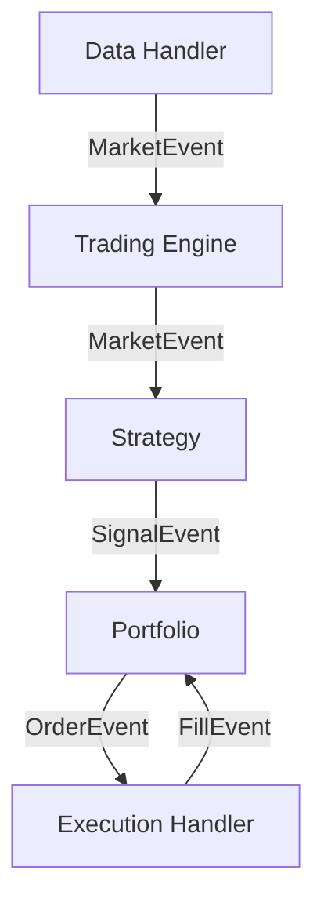

[Korean Version (한국어 가이드)](README_KR.md)

# LuminaQuant Documentation

**LuminaQuant** is an advanced, event-driven quantitative trading system designed for professional-grade backtesting and live trading. It features a modular architecture that supports multiple exchanges, robust state management, and sophisticated strategy optimization.

## Repository Role (Source of Truth)

- **Private source-of-truth repo** (maintainers/internal): `https://github.com/hoky1227/Quants-agent.git`
- **Public distribution repo** (external/read-only subset): `https://github.com/HokyoungJung/LuminaQuant.git`
- Python package/import namespace: `lumina_quant` (distribution name: `lumina-quant`)

---

## 📚 Documentation Index

| Section | Description |
| :--- | :--- |
| **[Installation & Setup](#installation)** | Getting started with LuminaQuant. |
| **[Deployment Guide](docs/DEPLOYMENT.md)** | Deployment notes and operational checklist. |
| **[Migration Guide](docs/MIGRATION_GUIDE_POSTGRES_PARQUET.md)** | Local-only migration to Parquet + PostgreSQL. |
| **[GPU Auto Notes](docs/DESIGN_NOTES_GPU_AUTO.md)** | Polars GPU/CPU auto-selection and fallback design. |
| **[Validation Report](docs/VALIDATION_REPORT.md)** | Verification + optimization report for core workflows. |
| **[Futures Strategy Factory](docs/FUTURES_STRATEGY_FACTORY.md)** | Candidate generation, weighted shortlist, and portfolio-set policy. |
| **[Scoring Config Guide](docs/SCORING_CONFIG_GUIDE.md)** | Shared score-config template usage across research/shortlist/optimization scripts. |
| **[Workflow Guide](docs/WORKFLOW.md)** | Private/Public branch operation and publish checklist. |
| **[8GB Baseline Quickstart](docs/QUICKSTART_8GB_BASELINE.md)** | Minimal install/smoke/replay/shadow-live/dashboard/safe-stop/cleanup flow. |
| **[Dashboard Realtime Report](docs/DASHBOARD_REALTIME_ANALYSIS_REPORT.md)** | Analysis + implementation report for live-refresh dashboard behavior. |
| **[Exchange Guide](docs/EXCHANGES.md)** | Detailed setup for **Binance** (CCXT) and **MetaTrader 5**. |
| **[Trading Manual](docs/TRADING_MANUAL.md)** | **How-To**: Buy/Sell, Leverage, TP/SL, Trailing Stops. |
| **[Performance Metrics](docs/METRICS.md)** | Explanation of Sharpe, Sortino, Alpha, Beta, etc. |
| **[Developer API](docs/API.md)** | How to write Strategies and extend the system. |
| **[Contributing](CONTRIBUTING.md)** | Local checks, CI parity commands, and PR expectations. |
| **[Security](SECURITY.md)** | Vulnerability reporting and credential handling policy. |
| **[Configuration](#configuration)** | Quick reference for `config.yaml`. |

## 🏗 Architecture

LuminaQuant follows a modular **Event-Driven Architecture**:


```mermaid
graph TD
    Data[Data Handler] -->|MarketEvent| Engine[Trading Engine]
    Engine -->|MarketEvent| Strategy[Strategy]
    Strategy -->|SignalEvent| Portfolio[Portfolio]
    Portfolio -->|OrderEvent| Execution[Execution Handler]
    Execution -->|FillEvent| Portfolio
```

- **DataHandler**: Manages historical (CSV) or live (WebSocket) data feeds.
- **Strategy**: Generates `SignalEvent` based on market data (e.g., RSI < 30).
- **Portfolio**: Manages state, positions, and risk. Converts Signals to `OrderEvent`.
- **ExecutionHandler**: Simulates fills (Backtest) or executes usage API (Live).

Current local-first stack defaults:
- **1s market store**: Parquet (ZSTD, exchange/symbol/date partitioning)
- **State/audit/job control**: PostgreSQL (local)
- **Backtest/optimization compute**: Polars Lazy with automatic GPU/CPU execution mode

---

## ⚙️ Setup & Configuration

### Prerequisites
- Python 3.11 to 3.13
- [uv](https://docs.astral.sh/uv/) for dependency/runtime management
- [Polars](https://pola.rs/) pinned to `polars>=1.35.2,<1.36` (for stable GPU adapter behavior)
- [Talib](https://github.com/TA-Lib/ta-lib-python) (for technical indicators)

### Environment Variables
For security, **never commit API keys**. Create a `.env` file in the root directory:

```ini
# .env file
BINANCE_API_KEY=your_api_key
BINANCE_SECRET_KEY=your_secret_key
LQ_POSTGRES_DSN=postgresql://localhost:5432/luminaquant
LQ_GPU_MODE=auto
LQ_GPU_DEVICE=0
LOG_LEVEL=INFO
```

*See `.env.example` for a template.*

---

## 🚀 Quick Start

### 1. Installation

```bash
# Clone the private source-of-truth repo (recommended for maintainers)
git clone https://github.com/hoky1227/Quants-agent.git
cd Quants-agent

# Public mirror alternative (external users/read-only workflow)
# git clone https://github.com/HokyoungJung/LuminaQuant.git
# cd LuminaQuant

# Ensure compatible Python (project requires < 3.14)
uv python pin 3.13

# Install base/runtime dependencies
uv sync --extra optimize --extra dev --extra live

# (Optional) GPU runtime on Linux x86_64 + CUDA 12
uv sync --extra gpu

# Verify install and tests
uv run python scripts/verify_install.py

# (Optional) For MT5 Support
uv sync --extra mt5
```

### 1-Minute Minimum Viable Run (No DB, No API Keys)

```bash
uv run python scripts/minimum_viable_run.py
```

This command generates tiny synthetic CSV data (if missing), forces a local CSV-only backtest profile, and runs a smoke backtest without requiring PostgreSQL or exchange credentials.

### 2. Configuration

LuminaQuant uses `config.yaml` for all settings.

**Generic Setup:**
```yaml
trading:
  symbols: ["BTC/USDT", "ETH/USDT"]
  timeframe: "1h"
  initial_capital: 10000.0
```

**Choose Your Exchange:**

*   **Binance (Crypto)**: Set `driver: "ccxt"`
*   **MetaTrader 5 (Forex/Stocks)**: Set `driver: "mt5"`

*👉 See [Exchange Guide](docs/EXCHANGES.md) for detailed credentials setup.*

### Public vs Private Repository Scope

- This public repository intentionally excludes proprietary research IP:
  - `src/lumina_quant/indicators/`
  - `strategies/`
  - private strategy/indicator test files
- This public repository also excludes DB construction/sync code:
  - `src/lumina_quant/data_sync.py`
  - `src/lumina_quant/data_collector.py`
  - `scripts/sync_binance_ohlcv.py`
  - `scripts/collect_market_data.py`
  - `tests/test_data_sync.py`
- Full strategy/indicator implementation and AGENTS guidance are maintained in the private repository.
- Database/runtime artifacts are never published (`data/`, `logs/`, `.omx/`, `.sisyphus/`).

### 3. Running the System

**(Private repo only) Sync Binance OHLCV into local Parquet market storage (and CSV mirror):**
```bash
uv run python scripts/sync_binance_ohlcv.py \
  --symbols BTC/USDT ETH/USDT \
  --timeframe 1m \
  --db-path data/market_parquet \
  --force-full
```

In the public repository, sync/build helpers are intentionally removed. Use prebuilt market parquet files or CSV data.

**Raw aggTrades → committed materialized pipeline (private repo):**
```bash
# 0) First bootstrap run (recommended): set explicit --since once.
uv run python scripts/collect_binance_aggtrades_raw.py \
  --symbols BTC/USDT,ETH/USDT \
  --db-path data/market_parquet \
  --since 2026-03-01T00:00:00Z \
  --no-periodic

# 1) Raw collector (checkpoint-resumable periodic loop)
uv run python scripts/collect_binance_aggtrades_raw.py \
  --symbols BTC/USDT,ETH/USDT \
  --db-path data/market_parquet \
  --periodic --poll-seconds 2 --cycles 2

# 2) Materializer (raw -> committed 1s + required trading.timeframes bundle)
uv run python scripts/materialize_market_windows.py \
  --symbols BTC/USDT,ETH/USDT \
  --timeframes 1s,1m,5m,15m,30m,1h,4h,1d \
  --db-path data/market_parquet \
  --periodic --poll-seconds 5 --cycles 2

# 3) Live trader (default = committed source; optional Binance live source via config flags)
uv run lq live
```

Collector bootstrap behavior:
- If `--since` is empty and no raw checkpoint exists yet, collector starts from
  `now - storage.collector_bootstrap_lookback_hours` (default: 24h).
- For deterministic initial coverage, prefer explicit `--since` on first run.

Materializer window behavior:
- If `--start-date/--end-date` are omitted, periodic materializer runs reuse the
  latest committed `1s` manifest and re-read only the UTC date partitions that can
  still change (for the default timeframe set, this is typically "current UTC day
  so far"; the replay span depends on the largest required timeframe plus any
  day-boundary gap since the last committed anchor).
- Use `--full-rebuild` to force the previous full-history scan behavior when you
  intentionally want a historical rebuild, or when raw backfills/repairs land
  earlier than the latest committed materializer anchor.

Pre-live committed data check:
```bash
uv run python - <<'PY'
from lumina_quant.storage.parquet import ParquetMarketDataRepository
repo = ParquetMarketDataRepository("data/market_parquet")
for symbol in ("BTC/USDT", "ETH/USDT"):
    frame = repo.load_committed_ohlcv_chunked(exchange="binance", symbol=symbol, timeframe="1s")
    print(symbol, frame.height, frame["datetime"].max())
PY
```

Rollout gate metrics (baseline/canary):
```bash
uv run python scripts/ci/export_market_window_gate_metrics.py \
  --input logs/live/market_window_metrics.ndjson \
  --output reports/live_rollout/baseline_gate_metrics.json \
  --window-hours 24 --require-flag false

uv run python scripts/ci/export_market_window_gate_metrics.py \
  --input logs/live/market_window_metrics.ndjson \
  --output reports/live_rollout/canary_gate_metrics.json \
  --window-hours 24 --require-flag true

uv run python scripts/ci/check_market_window_rollout_gates.py \
  --baseline reports/live_rollout/baseline_gate_metrics.json \
  --canary reports/live_rollout/canary_gate_metrics.json \
  --max-p95-payload-bytes 131072 \
  --max-queue-lag-increase-pct 5 \
  --max-fail-fast-incidents 0
```

**Backtest a Strategy:**
```bash
uv run lq backtest --data-mode raw-first

# Force DB-only data source
uv run lq backtest \
  --data-mode raw-first \
  --data-source db \
  --backtest-mode windowed \
  --market-db-path data/market_parquet
```

If `LQ_POSTGRES_DSN` is unset, backtest still runs but skips PostgreSQL audit persistence.

**Walk-Forward Optimization (multi-fold):**
```bash
uv run lq optimize --data-mode raw-first

# Prefer DB data, fallback to CSV in auto mode
uv run lq optimize \
  --data-mode raw-first \
  --data-source auto \
  --market-db-path data/market_parquet
```

**Preferred unified CLI (`lq`):**
```bash
uv run lq backtest --data-mode raw-first
uv run lq optimize --data-mode raw-first
uv run lq live --transport poll
uv run lq live --transport ws
uv run lq dashboard --run
```

Live migration flags (non-HFT incremental rollout):
```yaml
live:
  market_data_source: committed      # committed | binance_live
  order_state_source: polling        # polling | user_stream
  shadow_live_enabled: false
  reconciliation_poll_fallback_enabled: true
  book_ticker_enabled: false
```

Root compatibility shims were removed. Use `uv run lq ...` as the single supported entrypoint.

### Optional private extension package

Public/main and private/main can share the same repository layout.
Proprietary strategy/indicator implementations can be distributed separately as an extension package:

- package/module: `lumina_quant_private`
- optional strategy registry module: `lumina_quant_private.strategy_registry`
- optional indicator module: `lumina_quant_private.indicators`

When installed, `lumina_quant.strategies.registry` and `lumina_quant.indicators` auto-merge private exports at runtime.


### Windowed model parity + memory safety defaults

- `lq optimize` in parquet mode uses the same **windowed MarketWindow model** as live:
  - `HistoricParquetWindowedDataHandler`
  - `backtest_mode=windowed`
  - `backtest_poll_seconds` / `backtest_window_seconds` from config/env
- Parquet optimization enforces `MAX_WORKERS=1` for RAM safety.
- `lq backtest` auto-enables low-memory profile for ranges **>= 30 days** (or `LQ_BACKTEST_LOW_MEMORY=1`):
  - `record_history=False`
  - `record_trades=False`
  - `persist_output=False`
  - `track_metrics=True`
- WAL growth guard is enabled:
  - `storage.wal_max_bytes`
  - `storage.wal_compact_on_threshold`
  - `storage.wal_compaction_interval_seconds`
  - canonical compaction script: `scripts/compact_wal_to_monthly_parquet.py`

**Architecture/Lint Gate:**
```bash
bash scripts/ci/architecture_gate_live_data.sh
bash scripts/ci/architecture_gate_market_window_contract.sh
uv run python scripts/check_architecture.py
uv run ruff format . --check
uv run ruff check .
```

**8GB Baseline Gate (RSS/OOM/Disk/Benchmark):**
```bash
mkdir -p logs reports/benchmarks
/usr/bin/time -v \
  uv run python scripts/benchmark_backtest.py --iters 1 --warmup 0 --output reports/benchmarks/ci_smoke.json \
  2>&1 | tee logs/ci_smoke.time.log
uv run python scripts/verify_8gb_baseline.py \
  --benchmark reports/benchmarks/ci_smoke.json \
  --time-log logs/ci_smoke.time.log \
  --oom-log logs/ci_smoke.time.log \
  --skip-dmesg \
  --output reports/benchmarks/ci_8gb_gate.json
```

Full 8GB workflow: [docs/QUICKSTART_8GB_BASELINE.md](docs/QUICKSTART_8GB_BASELINE.md)

**Visualize Results:**
```bash
uv run streamlit run apps/dashboard/app.py
```

Dashboard now includes no-code workflow controls for backtest, optimization, and live launch/stop with:
- asynchronous managed jobs and log tail viewer
- explicit real-mode arming phrase (`ENABLE REAL`)
- graceful stop via control-file signal and emergency force-kill fallback
- optimization results panel from Postgres (`optimization_results`)
- ghost cleanup controls (dry-run/apply) for stale `RUNNING` rows
- strategy-scoped run filtering (`Filter Run IDs By Strategy`) and automatic run reselection on strategy change
- separate `Market Data DSN` so market OHLCV source can differ from runtime state DSN
- explicit CSV fallback warning when equity is rendered from CSV samples instead of Postgres run rows

**Ghost Cleanup CLI (stale RUNNING rows):**
```bash
# Dry-run (recommended first)
uv run python scripts/cleanup_ghost_runs.py --dsn \"$LQ_POSTGRES_DSN\" --stale-sec 300 --startup-grace-sec 90

# Apply cleanup
uv run python scripts/cleanup_ghost_runs.py --dsn \"$LQ_POSTGRES_DSN\" --stale-sec 300 --startup-grace-sec 90 --apply
```

**Realtime Dashboard Smoke Check (equity row growth):**
```bash
# Headless startup check
uv run python -m streamlit run apps/dashboard/app.py --server.headless true
```

**Start Live Trading:**
```bash
# Default entrypoint (polling market-data handler)
uv run lq live

# WebSocket market-data entrypoint (lower latency)
uv run lq live --transport ws

# Enable real Binance live stream source (config-driven)
# set in config.yaml: live.market_data_source: binance_live
# optional: live.order_state_source: user_stream
uv run lq live --transport ws

# Real mode requires explicit safety flag:
# LUMINA_ENABLE_LIVE_REAL=true uv run lq live --enable-live-real

# Graceful stop (recommended in ops): touch a stop file and pass it to runner
touch /tmp/lq.stop
uv run lq live --stop-file /tmp/lq.stop
```

**Generate Promotion Gate Report (Soak + Runtime Reliability):**
```bash
# Uses defaults from promotion_gate in config.yaml
uv run python scripts/generate_promotion_gate_report.py \
  --config config.yaml

# Strategy-specific profile from promotion_gate.strategy_profiles
uv run python scripts/generate_promotion_gate_report.py \
  --config config.yaml \
  --strategy RsiStrategy

# Generate Alpha Card scaffold from runtime config
uv run python scripts/generate_alpha_card_template.py \
  --config config.yaml \
  --strategy RsiStrategy \
  --output reports/alpha_card_rsi_strategy.md
```

**Backtest Benchmark Baseline/Regression:**
```bash
uv run python scripts/benchmark_backtest.py --output reports/benchmarks/baseline_snapshot.json

# Compare current run vs previous snapshot
uv run python scripts/benchmark_backtest.py \
  --output reports/benchmarks/current_snapshot.json \
  --compare-to reports/benchmarks/baseline_snapshot.json
```

**Strategy Factory Pipeline (manifest + shortlist):**
```bash
# Dry run
uv run python scripts/run_research_pipeline.py --dry-run

# Generate report + shortlist artifacts
uv run python scripts/run_research_pipeline.py \
  --db-path data/market_parquet \
  --mode standard \
  --timeframes 1m 5m 15m \
  --seeds 20260221 \
  --single-min-score 0.0 \
  --single-min-return 0.0 \
  --single-min-sharpe 0.7 \
  --single-min-trades 20 \
  --drop-single-without-metrics
```

Portfolio shortlist policy (default):
- **single strategy** must pass score/return/sharpe/trades floors to stay in shortlist
- **direct multi-asset strategy rows are excluded** from portfolio shortlist unless `--allow-multi-asset` is set
- portfolio-level candidates are emitted as **`portfolio_sets`** by combining successful single-asset strategies, each with normalized weights (`portfolio_weight`)

Score config template:
- Use `configs/score_config.example.json`
- Shared sections:
  - `candidate_research` → `scripts/run_research_candidates.py --score-config ...`
  - `portfolio_optimization` → `scripts/run_portfolio_optimization.py --score-config ...`
  - `strategy_shortlist` → `scripts/select_research_shortlist.py --score-config ...`
  - `research_hurdle` → `scripts/run_research_hurdle.py --score-config ...`

**Futures Support Feature Collection (funding / mark/index / OI):**
```bash
# Plan-only (default)
uv run python scripts/collect_strategy_support_data.py \
  --db-path data/market_parquet \
  --symbols BTC/USDT ETH/USDT XAU/USDT XAG/USDT

# Execute collection
uv run python scripts/collect_strategy_support_data.py \
  --db-path data/market_parquet \
  --execute

# Unified collector aligned to current OHLCV coverage + canonical inventory refresh
uv run python scripts/collect_all_strategy_support_data.py \
  --db-path data/market_parquet \
  --symbols BTC/USDT ETH/USDT XAU/USDT XAG/USDT \
  --force-full

# Rebuild the canonical inventory only
uv run python scripts/build_strategy_support_inventory.py \
  --db-path data/market_parquet
```

Collected feature points are stored in parquet-backed `futures_feature_points` datasets with:
- `funding_rate`, `funding_mark_price`
- `funding_fee_rate`, `funding_fee_quote_per_unit`
- `mark_price`, `index_price`
- `open_interest`
- `liquidation_long_qty`, `liquidation_short_qty`
- `liquidation_long_notional`, `liquidation_short_notional`

Canonical inventory outputs:
- `var/reports/strategy_support_inventory_latest.json`
- `var/reports/strategy_support_inventory_latest.csv`

**Fast Local Scan Profiles (avoid full 20min+ runs while iterating):**
```bash
# Very fast smoke scan (default)
uv run python scripts/quick_scan.py --profile quick

# Broader targeted scan
uv run python scripts/quick_scan.py --profile standard

# Full suite + build when needed
uv run python scripts/quick_scan.py --profile full --with-build

# Preview commands only
uv run python scripts/quick_scan.py --profile quick --dry-run
```

---

## 🌟 Key Features

- **Event-Driven Core**: Simulates realistic execution by processing events (`Market`, `Signal`, `Order`, `Fill`) sequentially.
- **Multi-Asset & Multi-Exchange**:
    - Trade **Crypto** on Binance, Bybit, Upbit (via CCXT).
    - Trade **Forex, CFTs, Stocks** on MetaTrader 5.
- **Advanced Backtesting**: Includes slippage, commission models, and trailing stop logic.
- **Optimization**: Built-in Bayesian Optimization using **Optuna** to find the best strategy parameters.
- **Live Resilience**:
    - **State Recovery**: Syncs positions on restart.
    - **Circuit Breakers**: Halts trading if daily loss exceeds limits.

---

## 📊 Dashboard Preview

The included Streamlit dashboard provides professional-grade analytics:

- **Equity Curve & Drawdowns**: Visualize your portfolio growth and risk.
- **Trade Analysis**: See exactly where buys and sells occurred on the chart.
- **Comprehensive Metrics**: Sharpe Ratio, Sortino, Calmar, Alpha, Beta, etc.

*👉 See [Performance Metrics](docs/METRICS.md) for a full definition of all stats.*
