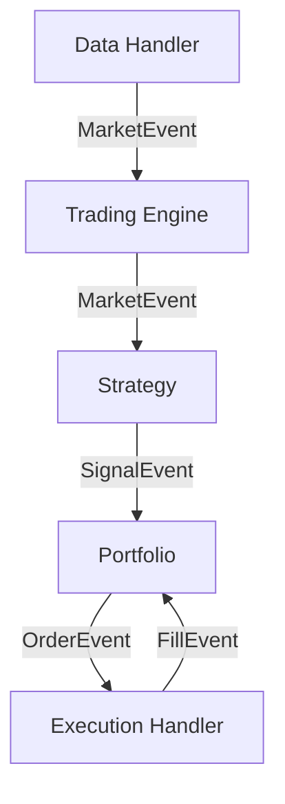

# LuminaQuant 문서

**LuminaQuant**는 전문적인 백테스팅 및 실거래를 위해 설계된 고급 이벤트 기반 퀀트 트레이딩 시스템입니다. 다중 거래소 지원, 강력한 상태 관리, 정교한 전략 최적화 기능을 갖춘 모듈식 아키텍처를 특징으로 합니다.

[English Version](README.md)

---

## 📚 문서 목차 (Documentation Index)

| 섹션 | 설명 |
| :--- | :--- |
| **[설치 및 설정](#설치-installation)** | LuminaQuant 시작하기. |
| **[대시보드 실시간 분석 리포트](docs/DASHBOARD_REALTIME_ANALYSIS_REPORT.md)** | 실시간 갱신 동작 개선 분석 및 구현 결과. |
| **[거래소 가이드](docs/kr/EXCHANGES.md)** | **바이낸스(Binance)** (CCXT) 및 **MetaTrader 5 (MT5)** 상세 설정법. |
| **[거래 매뉴얼](docs/kr/TRADING_MANUAL.md)** | **실전 운용법**: 매수/매도, 레버리지, TP/SL, 트레일링 스탑. |
| **[성과 지표](docs/kr/METRICS.md)** | Sharpe, Sortino, Alpha, Beta 등 지표에 대한 설명. |
| **[개발자 API](docs/kr/API.md)** | 전략 작성법 및 시스템 확장 가이드. |
| **[구성 (Configuration)](#구성-configuration)** | `config.yaml` 빠른 참조. |

---

## 🏗 아키텍처 (Architecture)

LuminaQuant는 모듈식 **이벤트 기반 아키텍처(Event-Driven Architecture)**를 따릅니다:



- **DataHandler**: 과거(CSV) 또는 실시간(WebSocket) 데이터 피드를 관리합니다.
- **Strategy**: 시장 데이터를 기반으로 `SignalEvent`를 생성합니다 (예: RSI < 30).
- **Portfolio**: 상태, 포지션, 리스크를 관리하며, 신호를 `OrderEvent`로 변환합니다.
- **ExecutionHandler**: 체결을 시뮬레이션(백테스트)하거나 API를 통해 실행(실거래)합니다.

---

## ⚙️ 설정 및 구성 (Setup & Configuration)

### 필수 요구사항 (Prerequisites)
- Python 3.11 이상 3.14 미만
- [uv](https://docs.astral.sh/uv/) (의존성/실행 환경 관리)
- [Polars](https://pola.rs/) (고성능 데이터 처리를 위해 사용)
- [Talib](https://github.com/TA-Lib/ta-lib-python) (기술적 지표 계산을 위해 사용)

### 환경 변수 (Environment Variables)
보안을 위해 **API 키를 절대 커밋하지 마세요**. 루트 디렉토리에 `.env` 파일을 생성하여 관리합니다:

```ini
# .env 파일 예시
BINANCE_API_KEY=your_api_key
BINANCE_SECRET_KEY=your_secret_key
LOG_LEVEL=INFO
```

*템플릿은 `.env.example` 파일을 참고하세요.*

---

## 🚀 빠른 시작 (Quick Start)

### 1. 설치 (Installation)

```bash
# 저장소 복제
git clone https://github.com/HokyoungJung/LuminaQuant.git
cd lumina-quant

# 프로젝트 Python 버전 고정 (< 3.14)
uv python pin 3.13

# 의존성 설치
uv sync --all-extras  # 또는 pip install ".[live,optimize,dashboard]"

# (선택 사항) MT5 지원을 위한 설치
uv sync --extra mt5
```

### 2. 구성 (Configuration)

LuminaQuant는 `config.yaml` 파일로 모든 설정을 관리합니다.

**일반 설정:**
```yaml
trading:
  symbols: ["BTC/USDT", "ETH/USDT"]
  timeframe: "1h"
  initial_capital: 10000.0
```

**거래소 선택:**

*   **바이낸스 (암호화폐)**: `driver: "ccxt"` 설정
*   **MetaTrader 5 (FX/주식)**: `driver: "mt5"` 설정

*👉 상세한 인증 설정 방법은 [거래소 가이드](docs/kr/EXCHANGES.md)를 참고하세요.*

### 3. 시스템 실행 (Running the System)

**바이낸스 OHLCV 전체 수집 + SQLite 업데이트 (+CSV 미러):**
```bash
uv run python scripts/sync_binance_ohlcv.py \
  --symbols BTC/USDT ETH/USDT \
  --timeframe 1m \
  --db-path logs/lumina_quant.db \
  --force-full
```

**전략 백테스트:**
```bash
uv run python run_backtest.py

# DB 데이터만 사용
uv run python run_backtest.py --data-source db --market-db-path logs/lumina_quant.db
```

**워크포워드 최적화:**
```bash
uv run python optimize.py

# DB 우선, 부족하면 CSV fallback
uv run python optimize.py --data-source auto --market-db-path logs/lumina_quant.db
```

**아키텍처/린트 검증:**
```bash
uv run python scripts/check_architecture.py
uv run ruff check .
```

**백테스트 성능 벤치마크/회귀 비교:**
```bash
uv run python scripts/benchmark_backtest.py --output reports/benchmarks/baseline_snapshot.json

# 이전 스냅샷과 비교
uv run python scripts/benchmark_backtest.py \
  --output reports/benchmarks/current_snapshot.json \
  --compare-to reports/benchmarks/baseline_snapshot.json
```

**결과 시각화 (대시보드):**
```bash
uv run streamlit run dashboard.py
```

**대시보드 실시간 스모크 체크 (equity row 증가 확인):**
```bash
# live trader가 logs/lumina_quant.db를 쓰는 동안 실행
uv run python scripts/smoke_dashboard_realtime.py \
  --db-path logs/lumina_quant.db \
  --require-running \
  --timeout-sec 90 \
  --poll-sec 3
```

**실거래 실행:**
```bash
uv run python run_live.py
```

---

## 🌟 주요 기능 (Key Features)

- **이벤트 기반 코어**: 이벤트(`Market`, `Signal`, `Order`, `Fill`)를 순차적으로 처리하여 현실적인 체결을 시뮬레이션합니다.
- **다중 자산 & 다중 거래소**:
    - CCXT를 통한 바이낸스, 업비트 등 **암호화폐** 거래.
    - MetaTrader 5를 통한 **FX, CFD, 주식** 거래.
- **고급 백테스팅**: 슬리피지, 수수료 모델, 트레일링 스탑 로직 포함.
- **최적화**: **Optuna**(베이지안 최적화)를 내장하여 최적의 전략 파라미터를 탐색.
- **실거래 안정성**:
    - **상태 복구**: 재시작 시 포지션 동기화.
    - **서킷 브레이커**: 일일 손실 한도 초과 시 거래 중단.

---

## 📊 대시보드 미리보기

내장된 Streamlit 대시보드는 전문가 수준의 분석을 제공합니다:

- **자산 곡선 & 낙폭**: 포트폴리오 성장과 리스크 시각화.
- **매매 분석**: 차트상에서 매수/매도 타점 확인.
- **포괄적 지표**: Sharpe Ratio, Sortino, Calmar, Alpha, Beta 등.

*👉 모든 통계의 정의는 [성과 지표](docs/kr/METRICS.md)를 참고하세요.*
