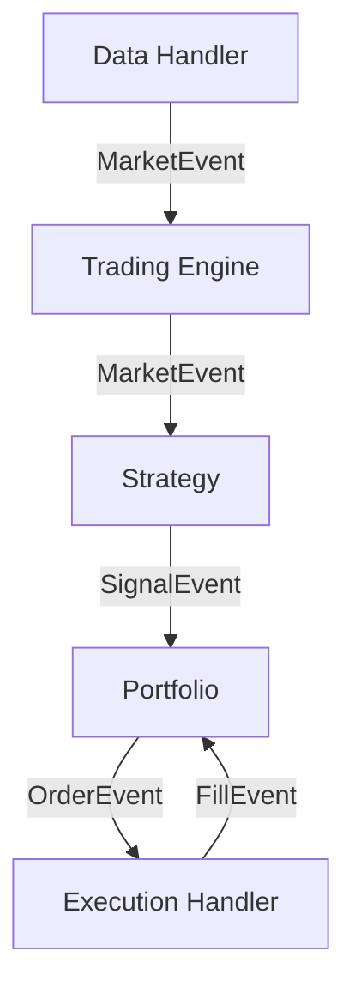

# LuminaQuant 문서

**LuminaQuant**는 전문적인 백테스팅 및 실거래를 위해 설계된 고급 이벤트 기반 퀀트 트레이딩 시스템입니다. 다중 거래소 지원, 강력한 상태 관리, 정교한 전략 최적화 기능을 갖춘 모듈식 아키텍처를 특징으로 합니다.

[English Version](README.md)

## 저장소 역할 (Source of Truth)

- **Private 원본 저장소** (유지보수/내부): `https://github.com/hoky1227/Quants-agent.git`
- **Public 배포 저장소** (외부/읽기 중심): `https://github.com/HokyoungJung/LuminaQuant.git`
- Python 패키지/임포트 네임스페이스: `lumina_quant` (배포명: `lumina-quant`)

---

## 📚 문서 목차 (Documentation Index)

| 섹션 | 설명 |
| :--- | :--- |
| **[설치 및 설정](#설치-installation)** | LuminaQuant 시작하기. |
| **[운영 워크플로우](docs/kr/WORKFLOW.md)** | Private/Public 브랜치 운영 및 공개 배포 체크리스트. |
| **[8GB 기준 Quickstart](docs/kr/QUICKSTART_8GB_BASELINE.md)** | 설치/스모크/섀도우라이브/대시보드/안전종료/정리 최소 절차. |
| **[마이그레이션 가이드](docs/MIGRATION_GUIDE_POSTGRES_PARQUET.md)** | 레거시 저장소 제거 후 Parquet + PostgreSQL 전환 가이드. |
| **[GPU 자동 실행 설계](docs/DESIGN_NOTES_GPU_AUTO.md)** | Polars GPU/CPU 자동 선택 및 fallback 전략 설명. |
| **[선물 전략 팩토리](docs/kr/FUTURES_STRATEGY_FACTORY.md)** | 후보 생성, 가중치 기반 숏리스트, 단일-자산 조합 정책. |
| **[스코어 설정 가이드](docs/kr/SCORING_CONFIG_GUIDE.md)** | 리서치/숏리스트/최적화 스크립트 공용 score-config 템플릿 사용법. |
| **[대시보드 실시간 분석 리포트](docs/DASHBOARD_REALTIME_ANALYSIS_REPORT.md)** | 실시간 갱신 동작 개선 분석 및 구현 결과. |
| **[거래소 가이드](docs/kr/EXCHANGES.md)** | **바이낸스(Binance)** (CCXT) 및 **MetaTrader 5 (MT5)** 상세 설정법. |
| **[거래 매뉴얼](docs/kr/TRADING_MANUAL.md)** | **실전 운용법**: 매수/매도, 레버리지, TP/SL, 트레일링 스탑. |
| **[성과 지표](docs/kr/METRICS.md)** | Sharpe, Sortino, Alpha, Beta 등 지표에 대한 설명. |
| **[개발자 API](docs/kr/API.md)** | 전략 작성법 및 시스템 확장 가이드. |
| **[기여 가이드](CONTRIBUTING.md)** | 로컬 체크/CI parity 명령/PR 기준. |
| **[보안 정책](SECURITY.md)** | 취약점 제보 및 자격증명 관리 정책. |
| **[구성 (Configuration)](#구성-configuration)** | `config.yaml` 빠른 참조. |

---

## 🏗 아키텍처 (Architecture)

LuminaQuant는 모듈식 **이벤트 기반 아키텍처(Event-Driven Architecture)**를 따릅니다:


```mermaid
graph TD
    Data[Data Handler] -->|MarketEvent| Engine[Trading Engine]
    Engine -->|MarketEvent| Strategy[Strategy]
    Strategy -->|SignalEvent| Portfolio[Portfolio]
    Portfolio -->|OrderEvent| Execution[Execution Handler]
    Execution -->|FillEvent| Portfolio
```

- **DataHandler**: 과거(CSV) 또는 실시간(WebSocket) 데이터 피드를 관리합니다.
- **Strategy**: 시장 데이터를 기반으로 `SignalEvent`를 생성합니다 (예: RSI < 30).
- **Portfolio**: 상태, 포지션, 리스크를 관리하며, 신호를 `OrderEvent`로 변환합니다.
- **ExecutionHandler**: 체결을 시뮬레이션(백테스트)하거나 API를 통해 실행(실거래)합니다.

현재 기본 로컬 스택:
- **1초 캔들 저장소**: Parquet(ZSTD, exchange/symbol/date 파티션)
- **상태/감사/잡 관리**: PostgreSQL(local)
- **백테스트/최적화 계산**: Polars Lazy + GPU 자동(`LQ_GPU_MODE=auto`)

---

## ⚙️ 설정 및 구성 (Setup & Configuration)

### 필수 요구사항 (Prerequisites)
- Python 3.11 이상 3.14 미만
- [uv](https://docs.astral.sh/uv/) (의존성/실행 환경 관리)
- [Polars](https://pola.rs/) `polars>=1.35.2,<1.36` 고정 (GPU 어댑터 안정성 기준)
- [Talib](https://github.com/TA-Lib/ta-lib-python) (기술적 지표 계산을 위해 사용)

### 환경 변수 (Environment Variables)
보안을 위해 **API 키를 절대 커밋하지 마세요**. 루트 디렉토리에 `.env` 파일을 생성하여 관리합니다:

```ini
# .env 파일 예시
BINANCE_API_KEY=your_api_key
BINANCE_SECRET_KEY=your_secret_key
LQ_POSTGRES_DSN=postgresql://localhost:5432/luminaquant
LQ_GPU_MODE=auto
LQ_GPU_DEVICE=0
LOG_LEVEL=INFO
```

*템플릿은 `.env.example` 파일을 참고하세요.*

---

## 🚀 빠른 시작 (Quick Start)

### 1. 설치 (Installation)

```bash
# Private 원본 저장소 복제 (유지보수 권장)
git clone https://github.com/hoky1227/Quants-agent.git
cd Quants-agent

# Public 미러 대안 (외부/읽기 중심)
# git clone https://github.com/HokyoungJung/LuminaQuant.git
# cd LuminaQuant

# 프로젝트 Python 버전 고정 (< 3.14)
uv python pin 3.13

# 기본/런타임 의존성 설치
uv sync --extra optimize --extra dev --extra live

# (선택 사항) Linux x86_64 + CUDA 12 GPU 런타임
uv sync --extra gpu

# 설치/테스트 기본 검증
uv run python scripts/verify_install.py

# (선택 사항) MT5 지원을 위한 설치
uv sync --extra mt5
```

### 1분 최소 실행 (DB/API 키 불필요)

```bash
uv run python scripts/minimum_viable_run.py
```

이 명령은 (필요 시) 작은 synthetic CSV 데이터를 생성하고, 로컬 CSV 전용 백테스트 프로필로 스모크 백테스트를 실행합니다. PostgreSQL/거래소 키가 필요 없습니다.

### 2. 구성 (Configuration)

LuminaQuant는 `config.yaml` 파일로 모든 설정을 관리합니다.

**일반 설정:**
```yaml
trading:
  symbols: ["BTC/USDT", "ETH/USDT"]
  timeframe: "1h"
  initial_capital: 10000.0
```

**거래소 선택:**

*   **바이낸스 (암호화폐)**: `driver: "ccxt"` 설정
*   **MetaTrader 5 (FX/주식)**: `driver: "mt5"` 설정

*👉 상세한 인증 설정 방법은 [거래소 가이드](docs/kr/EXCHANGES.md)를 참고하세요.*

### Public / Private 저장소 범위

- Public 저장소에서는 아래 연구 IP를 의도적으로 제외합니다.
  - `src/lumina_quant/indicators/`
  - `strategies/`
  - 전략/지표 전용 테스트 파일
- Public 저장소에서는 DB 구축/동기화 코드도 제외합니다.
  - `src/lumina_quant/data_sync.py`
  - `src/lumina_quant/data_collector.py`
  - `scripts/sync_binance_ohlcv.py`
  - `scripts/collect_market_data.py`
  - `tests/test_data_sync.py`
- 전략/지표 전체 구현 및 AGENTS 가이드는 Private 저장소에서 관리합니다.
- DB/런타임 산출물은 게시하지 않습니다 (`data/`, `logs/`, `.omx/`, `.sisyphus/`).

### 3. 시스템 실행 (Running the System)

**(Private 저장소 전용) 바이낸스 OHLCV 전체 수집 + Parquet 업데이트 (+CSV 미러):**
```bash
uv run python scripts/sync_binance_ohlcv.py \
  --symbols BTC/USDT ETH/USDT \
  --timeframe 1m \
  --db-path data/market_parquet \
  --force-full
```

Public 저장소에는 DB 동기화/구축 헬퍼를 의도적으로 포함하지 않습니다. 사전 구축된 DB 파일 또는 CSV 데이터를 사용하세요.

**Raw aggTrades → 커밋된 materialized 파이프라인 (Private 저장소):**
```bash
# 0) 최초 부트스트랩(권장): 처음 1회는 --since를 명시하세요.
uv run python scripts/collect_binance_aggtrades_raw.py \
  --symbols BTC/USDT,ETH/USDT \
  --db-path data/market_parquet \
  --since 2026-03-01T00:00:00Z \
  --no-periodic

# 1) Raw 수집기 (체크포인트 재개 + 주기 루프)
uv run python scripts/collect_binance_aggtrades_raw.py \
  --symbols BTC/USDT,ETH/USDT \
  --db-path data/market_parquet \
  --periodic --poll-seconds 2 --cycles 2

# 2) Materializer (raw -> 커밋된 1s + trading.timeframes 번들)
uv run python scripts/materialize_market_windows.py \
  --symbols BTC/USDT,ETH/USDT \
  --timeframes 1s,1m,5m,15m,30m,1h,4h,1d \
  --db-path data/market_parquet \
  --periodic --poll-seconds 5 --cycles 2

# 3) Live 트레이더 (기본=committed 소스, 설정으로 Binance 실시간 소스 가능)
uv run lq live
```

Collector 부트스트랩 동작:
- `--since`가 비어 있고 raw 체크포인트도 없으면
  `now - storage.collector_bootstrap_lookback_hours`(기본 24시간)부터 시작합니다.
- 초기 커버리지를 정확히 맞추려면 최초 1회는 `--since`를 명시하는 것을 권장합니다.

Materializer 윈도우 동작:
- `--start-date/--end-date`를 비우면, 주기적 materializer는 최신 `1s` 커밋
  manifest를 기준으로 아직 변경될 수 있는 UTC 날짜 파티션만 다시 읽습니다
  (기본 timeframe 세트에서는 보통 "당일 UTC 구간"만 재계산하며, 실제 재생 범위는
  가장 큰 required timeframe과 마지막 커밋 anchor 이후의 날짜 경계 차이에 따라 달라집니다).
- 과거 전체를 의도적으로 다시 만들거나, 마지막 materializer anchor보다 더 과거에
  raw 백필/수정이 들어왔으면 `--full-rebuild`를 사용하세요.

라이브 시작 전 커밋 데이터 확인:
```bash
uv run python - <<'PY'
from lumina_quant.storage.parquet import ParquetMarketDataRepository
repo = ParquetMarketDataRepository("data/market_parquet")
for symbol in ("BTC/USDT", "ETH/USDT"):
    frame = repo.load_committed_ohlcv_chunked(exchange="binance", symbol=symbol, timeframe="1s")
    print(symbol, frame.height, frame["datetime"].max())
PY
```

롤아웃 게이트 메트릭(베이스라인/카나리):
```bash
uv run python scripts/ci/export_market_window_gate_metrics.py \
  --input logs/live/market_window_metrics.ndjson \
  --output reports/live_rollout/baseline_gate_metrics.json \
  --window-hours 24 --require-flag false

uv run python scripts/ci/export_market_window_gate_metrics.py \
  --input logs/live/market_window_metrics.ndjson \
  --output reports/live_rollout/canary_gate_metrics.json \
  --window-hours 24 --require-flag true

uv run python scripts/ci/check_market_window_rollout_gates.py \
  --baseline reports/live_rollout/baseline_gate_metrics.json \
  --canary reports/live_rollout/canary_gate_metrics.json \
  --max-p95-payload-bytes 131072 \
  --max-queue-lag-increase-pct 5 \
  --max-fail-fast-incidents 0
```

**전략 백테스트:**
```bash
uv run lq backtest --data-mode raw-first

# DB 데이터만 사용
uv run lq backtest \
  --data-mode raw-first \
  --data-source db \
  --backtest-mode windowed \
  --market-db-path data/market_parquet
```

`LQ_POSTGRES_DSN`이 없으면 백테스트는 계속 실행되지만 PostgreSQL 감사(audit) 저장은 건너뜁니다.

**워크포워드 최적화:**
```bash
uv run lq optimize --data-mode raw-first

# DB 우선, 부족하면 CSV fallback
uv run lq optimize \
  --data-mode raw-first \
  --data-source auto \
  --market-db-path data/market_parquet
```

**권장 통합 CLI (`lq`):**
```bash
uv run lq backtest --data-mode raw-first
uv run lq optimize --data-mode raw-first
uv run lq live --transport poll
uv run lq live --transport ws
uv run lq dashboard --run
```

루트 호환 shim은 제거되었습니다. `uv run lq ...`를 단일 공식 엔트리포인트로 사용하세요.

### 선택적 private 확장 패키지

public/main과 private/main은 동일한 저장소 레이아웃을 유지할 수 있습니다.
비공개 전략/지표 구현은 별도 확장 패키지로 배포하면 됩니다.

- 패키지/모듈: `lumina_quant_private`
- 선택적 전략 레지스트리: `lumina_quant_private.strategy_registry`
- 선택적 지표 모듈: `lumina_quant_private.indicators`

해당 패키지가 설치되면 `lumina_quant.strategies.registry`와 `lumina_quant.indicators`가 런타임에 자동으로 private export를 병합합니다.


**전략 팩토리 파이프라인 (후보 + 숏리스트):**
```bash
# dry-run
uv run python scripts/run_research_pipeline.py --dry-run

# 후보/숏리스트 생성
uv run python scripts/run_research_pipeline.py \
  --db-path data/market_parquet \
  --mode standard \
  --timeframes 1m 5m 15m \
  --seeds 20260221 \
  --single-min-score 0.0 \
  --single-min-return 0.0 \
  --single-min-sharpe 0.7 \
  --single-min-trades 20 \
  --drop-single-without-metrics
```

포트폴리오 숏리스트 기본 정책:
- **단일 전략**은 score/return/sharpe/trades 기준을 통과하지 못하면 제외
- `--allow-multi-asset`을 명시하지 않으면 **직접 multi-asset 전략은 포트폴리오 숏리스트에서 제외**
- 최종 포트폴리오 후보는 성과가 검증된 단일 전략을 자산별로 묶은 **`portfolio_sets`**(가중치 `portfolio_weight`)로 생성

**아키텍처/린트 검증:**
```bash
bash scripts/ci/architecture_gate_live_data.sh
bash scripts/ci/architecture_gate_market_window_contract.sh
uv run python scripts/check_architecture.py
uv run ruff check .
```

**8GB 기준 게이트 (RSS/OOM/디스크/벤치마크):**
```bash
mkdir -p logs reports/benchmarks
/usr/bin/time -v \
  uv run python scripts/benchmark_backtest.py --iters 1 --warmup 0 --output reports/benchmarks/ci_smoke.json \
  2>&1 | tee logs/ci_smoke.time.log
uv run python scripts/verify_8gb_baseline.py \
  --benchmark reports/benchmarks/ci_smoke.json \
  --time-log logs/ci_smoke.time.log \
  --oom-log logs/ci_smoke.time.log \
  --skip-dmesg \
  --output reports/benchmarks/ci_8gb_gate.json
```

전체 8GB 절차: [docs/kr/QUICKSTART_8GB_BASELINE.md](docs/kr/QUICKSTART_8GB_BASELINE.md)

**PostgreSQL 스키마 초기화:**
```bash
uv run python scripts/init_postgres_schema.py --dsn "$LQ_POSTGRES_DSN"
```

**백테스트 성능 벤치마크/회귀 비교:**
```bash
uv run python scripts/benchmark_backtest.py --output reports/benchmarks/baseline_snapshot.json

# 이전 스냅샷과 비교
uv run python scripts/benchmark_backtest.py \
  --output reports/benchmarks/current_snapshot.json \
  --compare-to reports/benchmarks/baseline_snapshot.json
```

**전략 팩토리 파이프라인 (manifest + shortlist):**
```bash
# Dry run
uv run python scripts/run_research_pipeline.py --dry-run

# 단일 전략 성과 필터 + 가중치 + portfolio_sets 생성
uv run python scripts/run_research_pipeline.py \
  --db-path data/market_parquet \
  --mode standard \
  --timeframes 1m 5m 15m \
  --seeds 20260221 \
  --single-min-score 0.0 \
  --single-min-return 0.0 \
  --single-min-sharpe 0.7 \
  --single-min-trades 20 \
  --drop-single-without-metrics
```

기본 shortlist 정책:
- 단일 전략은 score/return/sharpe/trades 기준을 통과해야 포함
- direct multi-asset 행은 기본 제외 (`--allow-multi-asset`으로 허용)
- 성공한 단일-자산 전략 조합으로 `portfolio_sets`가 생성되고 각 멤버에 `portfolio_weight`가 부여됨

스코어 설정 템플릿:
- `configs/score_config.example.json` 사용
- 공용 섹션:
  - `candidate_research` → `scripts/run_research_candidates.py --score-config ...`
  - `portfolio_optimization` → `scripts/run_portfolio_optimization.py --score-config ...`
  - `strategy_shortlist` → `scripts/select_research_shortlist.py --score-config ...`
  - `research_hurdle` → `scripts/run_research_hurdle.py --score-config ...`

**결과 시각화 (대시보드):**
```bash
uv run streamlit run apps/dashboard/app.py
```

대시보드 개선 사항:
- 전략별 Run 필터(`Filter Run IDs By Strategy`) 및 전략 변경 시 Run 자동 재선택
- 감사 상태(PostgreSQL)와 시장 OHLCV(Parquet) 소스를 분리하여 표시
- 런타임 데이터가 없을 때 CSV fallback 상태를 명시적으로 경고

**대시보드 실시간 스모크 체크 (equity row 증가 확인):**
```bash
uv run python -m streamlit run apps/dashboard/app.py --server.headless true
```

**Ghost RUNNING 정리 (PostgreSQL):**
```bash
# dry-run
uv run python scripts/cleanup_ghost_runs.py \
  --dsn "$LQ_POSTGRES_DSN" \
  --stale-sec 300 \
  --startup-grace-sec 90

# apply
uv run python scripts/cleanup_ghost_runs.py \
  --dsn "$LQ_POSTGRES_DSN" \
  --stale-sec 300 \
  --startup-grace-sec 90 \
  --apply
```

**실거래 실행:**
```bash
# 기본 엔트리포인트 (폴링 기반 시장데이터 핸들러)
uv run lq live

# WebSocket 엔트리포인트 (더 낮은 지연)
uv run lq live --transport ws

# real 모드는 명시적 안전 플래그가 필요
# LUMINA_ENABLE_LIVE_REAL=true uv run lq live --enable-live-real

# 운영 권장: stop-file 기반 정상 종료
touch /tmp/lq.stop
uv run lq live --stop-file /tmp/lq.stop
```

---

## 🌟 주요 기능 (Key Features)

- **이벤트 기반 코어**: 이벤트(`Market`, `Signal`, `Order`, `Fill`)를 순차적으로 처리하여 현실적인 체결을 시뮬레이션합니다.
- **다중 자산 & 다중 거래소**:
    - CCXT를 통한 바이낸스, 업비트 등 **암호화폐** 거래.
    - MetaTrader 5를 통한 **FX, CFD, 주식** 거래.
- **고급 백테스팅**: 슬리피지, 수수료 모델, 트레일링 스탑 로직 포함.
- **최적화**: **Optuna**(베이지안 최적화)를 내장하여 최적의 전략 파라미터를 탐색.
- **실거래 안정성**:
    - **상태 복구**: 재시작 시 포지션 동기화.
    - **서킷 브레이커**: 일일 손실 한도 초과 시 거래 중단.

---

## 📊 대시보드 미리보기

내장된 Streamlit 대시보드는 전문가 수준의 분석을 제공합니다:

- **자산 곡선 & 낙폭**: 포트폴리오 성장과 리스크 시각화.
- **매매 분석**: 차트상에서 매수/매도 타점 확인.
- **포괄적 지표**: Sharpe Ratio, Sortino, Calmar, Alpha, Beta 등.

*👉 모든 통계의 정의는 [성과 지표](docs/kr/METRICS.md)를 참고하세요.*
